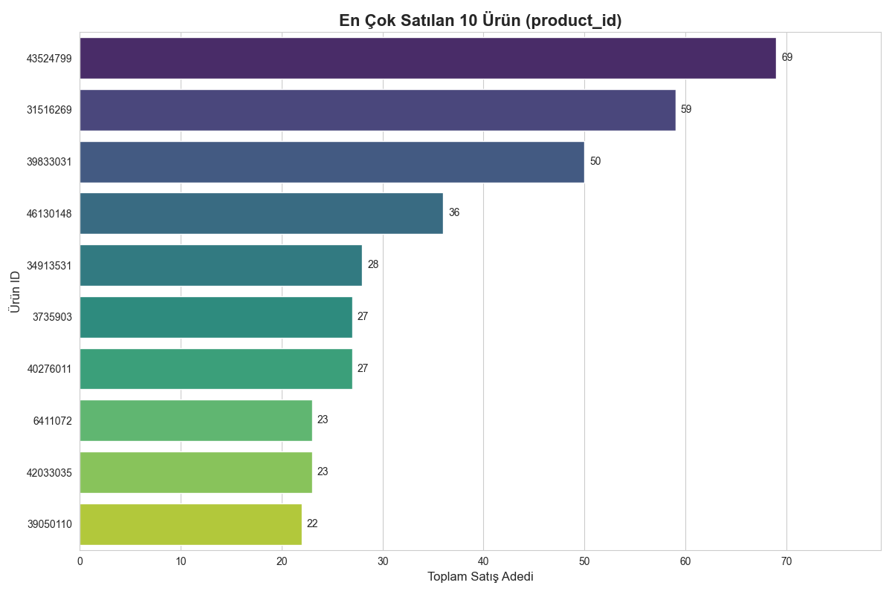
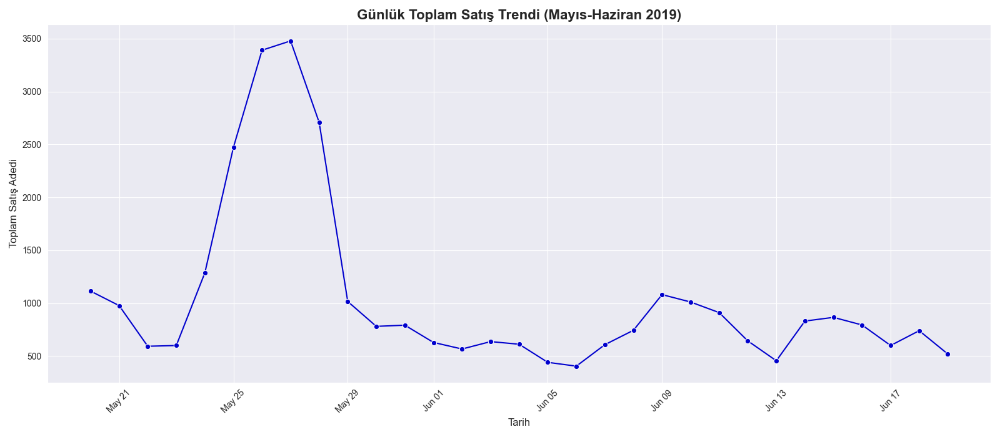

# 📊 Proje: E-Ticaret Satış Veri Analizi

Bu proje, bir e-ticaret sitesine ait satış veri setini analiz ederek şirketin satış performansını, popüler ürünlerini ve müşteri davranışlarını anlamayı amaçlamaktadır.

## 🎯 Amaç

Analiz sonucunda yönetime aşağıdaki konularda içgörüler sunulmuştur:
* Hangi ürünlere odaklanılmalı?
* Satış trendleri nasıldır?
* Müşteri veri kalitesi nasıl iyileştirilebilir?

## 🛠️ Kullanılan Teknolojiler

* **Python 3**
* **Pandas:** Veri manipülasyonu ve analizi
* **Numpy:** Sayısal hesaplamalar
* **Matplotlib & Seaborn:** Veri görselleştirme

## 📈 Analizden Çıkan Sonuçlar

### 1. En Popüler Ürünler


*Analiz, en çok satan 10 ürünü belirlemiştir. Stok ve pazarlama bütçesi bu ürünlere odaklanabilir.*



### 2. Günlük Satış Trendi

*Satışlar özellikle Mayıs sonu ve Haziran başında yoğunlaşmıştır. Günlük bazda dalgalanmalar mevcuttur.*



## 🚀 Projeyi Çalıştırma

1.  Bu depoyu klonlayın veya indirin.
2.  Gerekli kütüphaneleri yükleyin:
    ```bash
    pip install pandas numpy matplotlib seaborn
    ```
3.  Veri setini [bu Kaggle linkinden](https://www.kaggle.com/datasets/berkayalan/ecommerce-sales-dataset/data) indirin.
4.  `basket_details.csv` ve `customer_details.csv` dosyalarını `analiz.py` kodunun bulunduğu klasöre kopyalayın.
5.  `analiz.py` dosyasını çalıştırın:
    ```bash
    python analiz.py
    ```

**Not:** Kodun düzgün çalışması için `analiz.py` dosyasındaki yerel dosya yolları (`C:\\Users\\...`) kaldırılmalı ve dosyalar doğrudan aynı klasörden okunmalıdır.
